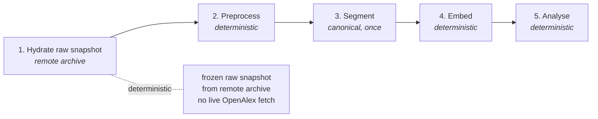

# Dissertation Reproducibility Guide

## What this repository contains

This repository contains the dissertation code, manuscript source, committed outputs, and the canonical reproducibility entrypoint for the submitted MSc project. The dissertation measures research-policy divergence in AI-for-SDG discourse using coverage and semantic-gap outputs. The README is operational only; the manuscript explains the research design, findings, and limitations.

## Prerequisites

| Requirement | Details |
|---|---|
| **Disk space** | Embedded snapshot: ~14 GB archive. Raw snapshot: ~3.7 GB archive |
| **Platform** | Full pipeline tested end-to-end on WSL (Ubuntu); both `--cold-replay` and `--warm-replay-without-appendix` / `--warm-replay-with-appendix` were tested and worked on WSL (08-28) and on native Windows (07-26). `--cold-replay` hydrates from the remote raw archive (no live OpenAlex fetch). On Windows (native) `--warm-replay-without-appendix` / `--warm-replay-with-appendix` and `--appendix-all` also work. `--build-pdf` requires bash (WSL/Linux only) |
| **Conda** | Required — environment is defined in `environment.yml` |
| **RAM / VRAM** | 10 GB RAM + 4 GB VRAM is sufficient for the full pipeline (warm replay and cold replay). CPU-only warm replay works on the same RAM budget |
| **Network** | Required for `conda env create` (packages) and `--fetch-data-snapshot` (archive download). For `--cold-replay`, the canonical run hydrates the frozen **raw snapshot** from the remote archive (offline/deterministic, no OpenAlex); only a forced **live OpenAlex re-fetch** needs the OpenAlex API (see Credentials). Cold replay otherwise only needs the HuggingFace model download (one-time, cached). Warm replay is fully offline once Conda exists and the snapshot is hydrated |
| **LaTeX** | `latexmk` + `pdflatex` + `biber` for `--build-pdf` |
| **rclone** | Required for `--backup-data-snapshot` only (maintainer tool). Override remote via `--remote-root` or `DISSERTATION_SNAPSHOT_REMOTE_ROOT`. Not needed for warm/cold replay |
| **OpenAlex key(s)** | `.env` with `OPENALEX_MAILTO` + `OPENALEX_API_KEY` — only if you force a **live** `--cold-replay` OpenAlex re-fetch. The canonical cold replay hydrates the frozen **raw snapshot** from the remote archive and needs **no** key (deterministic/offline). The full live re-fetch cycles through up to 4 parallel API keys and takes approximately 1 week |
| **Embedding runtimes** (one-time, cold replay only) | Segmentation is **canonical and shared** — one ~17h pass at 384 tokens produces segments reused by every encoder. MPNet (`all-mpnet-base-v2`, primary) embeds the full corpus (~17h on 4 GB VRAM). MiniLM and SciBERT embed only the shared 100k-paper subset (~minutes each). SciBERT also loads as a raw BERT wrapped with mean pooling |
| **Git** | Required for cloning and pulling updates |

All other dependencies (Python packages, LaTeX packages) are handled by Conda.

## Quick start for markers

"Warm replay" means running the full analysis pipeline from pre-computed
embeddings, skipping the expensive fetch and embed stages. It is the canonical
reproducibility target — deterministic and snapshot-based.

```bash
git clone https://github.com/qmanhbeo/msc-dissertation-leo.git
cd msc-dissertation-leo
conda env create -f environment.yml
conda activate dissertation-leo
# optional: if you have an NVIDIA GPU with CUDA 12.1:
# pip install torch==2.5.1+cu121 --extra-index-url https://download.pytorch.org/whl/cu121

# One-time: warm the HuggingFace encoder models (MPNet + MiniLM + SciBERT)
# into the local cache. Not needed for warm replay (it never loads an encoder);
# required before a cold replay, which re-embeds from the raw snapshot.
python main.py --fetch-encoder-models

python main.py --warm-replay-without-appendix --overwrite
```

This rebuilds main text outputs from the frozen embedded data snapshot.
Appendix outputs are already committed in the repo and do not need
regeneration. Two analysis families are intentionally not regenerated by
replay — see [Intentionally NOT regenerated by replay](#intentionally-not-regenerated-by-replay).
`--overwrite` is included because canonical outputs already exist
in the repo; without it `main.py` fails closed to prevent accidental replacement.
If the snapshot download fails, run `python main.py --fetch-data-snapshot embedded`
then retry.

```bash
# One-time: REQUIRED before cold replay — warm the HuggingFace encoder models
# (MPNet + MiniLM + SciBERT) into the local cache.
python main.py --fetch-encoder-models

# NOTE: --cold-replay rebuilds embeddings from scratch using the frozen raw
# snapshot. GPU embedding is not bit-deterministic across hardware (CUDA
# determinism flags were tested but hurt runtime too much), so results may
# differ at the last mantissa bits. Use --warm-replay (above) for exact
# reproduction of the submitted outputs.
python main.py --cold-replay --overwrite
```

## What the replay produces

Warm replay rebuilds:
- canonical machine-readable outputs under `4_outputs/{model}/data/`
- manuscript tables and figures under `4_outputs/{model}/tables/` and `4_outputs/{model}/figures/`

To build the dissertation PDF from warm-replay outputs, run `python main.py --build-pdf --overwrite` (requires bash — WSL/Linux only). If you have your own LaTeX distribution, you can also compile `3_writing/dissertation.tex` directly with `latexmk`, `pdflatex` + `biber`, or your preferred compiler. To build a Word (`.docx`) copy from the same outputs, run `python main.py --build-word --overwrite` (requires `pandoc` and `3_writing/custom_thesis_template.docx`; produces `4_outputs/dissertation.docx` styled in Times New Roman).

Word-table formatting is customized on top of pandoc: bold header rows, single cell line spacing and tighter cell padding are declarative in the `custom_thesis_template.docx` styles (`Table` firstRow rule + `Compact` style), as is horizontal centering of captions and figures (`TableCaption`/`ImageCaption`/`CaptionedFigure` styles); row keep-together (`cantSplit`), header-to-body gluing (`keepNext`), header promotion for the tables whose headers pandoc fails to tag (`\shortstack` / multi-row `\multicolumn` headers), horizontal table centering, and centering of the `Notes:` paragraphs are applied by `3_writing/style_tables_docx.py`, which `build_word.sh` runs right after pandoc. It fails closed on stale templates or double application and never touches text content, so the declared word count is unaffected.

### Intentionally NOT regenerated by replay

Two analysis families are deliberately excluded from warm/cold replay because
they are too slow for a quick replay. Their committed `4_outputs/` files are
the submission state — a fresh clone builds the PDF from them unchanged.

1. **Distributional gap tables** (Appendix G: `tab13_distributional_gap.tex`,
   `tab14_distributional_h1.tex`, plus the `num13`/`num18` macros cited by the
   main text). To regenerate before `--build-pdf`, order matters and
   `--embeddings adjusted` is REQUIRED because dissertation.tex reads the
   adjusted track (`4_outputs/{model}/adjusted/tables/`):
   ```bash
   python main.py --appendix-g-distributional --embeddings adjusted --overwrite
   python main.py --appendix-g-distributional-h1 --overwrite   # needs the step above first
   ```
2. **Model-selection grid search** (Appendix D.1). The search itself is a
   parked one-off; its raw results live under `4_outputs/not_in_replay/`
   (a naming convention for artifacts intentionally outside replay), and
   `--appendix-d1-model-selection` only re-exports CV macros from those
   committed results, so it can be run standalone at any time.

Both replays print this notice again when they finish.

## Pipeline architecture

The analysis pipeline measures research-policy divergence in AI-for-SDG discourse
using **three method axes** that share a unified data-preparation pipeline:

### Unified stages (shared by all axes)

```
Preprocess (8 scripts) → Segment (canonical, 7 corpora ONCE) → Embed (8 reference/policy shared + research: full for primary, 100k subset for sensitivity)
```

- **Labeled corpora** (ground-truth SDG labels): osdg, benchmark, sdg_knowledge_hub, sdgi, aurora
- **Unlabeled corpora** (to be assigned): research (OpenAlex), policy_scrape, policy_manual, ungdc_sdg
- osdg and benchmark are **not segmented** (embedded directly from preprocessed JSONL)
- sdgi plays a **dual role**: labeled training corpus AND merged into `policy.npy`
- **All sensitivity encoders reuse the canonical (MPNet) segmented texts.** Segmentation runs ONCE at 384 tokens; every model embeds those identical segments so the only varying factor is the encoder. Research: MPNet embeds the full corpus; **MiniLM and SciBERT embed a shared 100k-paper subset** (`research_subset`, deterministic seed-42 draw). Reference/policy: all models embed the canonical segments (`--seg-model all-mpnet-base-v2`). This removes the earlier per-model segmentation (and its chunking confound) plus the ~20GB+/model of redundant segmented text.

The shared training-data prep (`0_prepare_data.py`) writes `embeddings.npy`, `labels.npy`,
`sources.npy`, and train/test split indices to `2_data/4_supervised_model_results/{model}/`.

### Three method axes

| Axis | Classifier | Centroid built | Consumed by | Role |
|---|---|---|---|---|
| **A — Supervised LR** | Logistic Regression (C=10, lbfgs) | `research_centroids.npy` (from LR-assigned research papers) in `5_supervised_scored/{model}/` | `1_semantic_gap`, `0_coverage_gap`, `3_generate_cross_sensitivity_table` | **PRIMARY** — reported in dissertation main text |
| **B — Supervised MLP** | 4-layer MLP (384-hidden) | `mlp_research_centroids.npy` in `5_supervised_scored/{model}/mlp_scores/` | `3_generate_cross_sensitivity_table` | Sensitivity axis |
| **C — Zeroshot** | Nearest-centroid assignment | `sdg_centroids.npy` (reference, from labeled train split), `zeroshot/research_centroids.npy`, `zeroshot/policy_centroids.npy` in `4_outputs/{model}/zeroshot/` | `3_generate_cross_sensitivity_table`, `0_check_centroid_consistency`, `1_build_centroid_similarity_matrix` | Sensitivity axis |

The **reference centroids** (`sdg_centroids.npy`) are built once from the labeled
training split and serve as:
- the assignment target for zeroshot scoring,
- the input to the centroid similarity matrix, and
- the basis for PCA semantic-landscape visualisation.

The **supervised research centroids** (`research_centroids.npy` from `score_supervised --lr --research`)
are the primary input to the semantic-gap analysis; the zeroshot produces its own
research/policy centroids in a separate namespace for cross-method comparison.

### Build-order constraint

```mermaid
flowchart TD
    subgraph T1["Tier 1 — Corpus Construction (four parallel intake tracks)"]
        direction TB
        subgraph B["Keyword-research (primary)"]
            SB["OpenAlex API<br>68 Boolean queries (17 SDG × 4 AI terms)"]
            PB["1_preprocess/0_preprocess_papers_streaming.py<br>SDG filter: native, min 20 words"]
            SGB["2_segment/1_segment_corpus.py<br>Research abstracts → segments"]
            SB --> PB --> SGB
        end
        subgraph A["Concept-research (robustness track)"]
            SA["OpenAlex concept tags<br>AI/ML field-of-study"]
            PA["1_preprocess/0_preprocess_papers_streaming.py<br>SDG filter: none, capped 100k"]
            SGA["2_segment/1_segment_corpus.py<br>~100k papers, classifier-assigned SDG"]
            SA --> PA --> SGA
        end
        subgraph C["Policy"]
            SC["4 policy sources<br>curated / SDGi VNR-VLR / UNGDC / scrape+manual"]
            PC["1_preprocess/0_preprocess_policy.py (+ 1_preprocess/1_build_policy_corpus.py)<br>min 20 words"]
            SGC["2_segment/1_segment_corpus.py<br>Policy documents → segments (merge)"]
            SC --> PC --> SGC
        end
        subgraph D["Reference"]
            SD["5 reference corpora<br>OSDG / Benchmark / KH / SDGi / Aurora"]
            PD["1_preprocess/0_preprocess_osdg.py<br>0_preprocess_sdg_benchmark.py<br>0_preprocess_sdg_knowledge_hub.py<br>0_preprocess_sdgi_unified.py<br>0_preprocess_aurora.py<br>0_preprocess_ungdc_sdg.py"]
            SGD["2_segment/1_segment_corpus.py<br>single-label reference segments (bypass)"]
            SD --> PD --> SGD
        end
    end

    EMB["3_embed/0_embed_paper_shards.py (research: full MPNet / 100k subset MiniLM·SciBERT)<br>3_embed/0_embed_reference_and_policy_corpora.py<br>Shared MPNet 768d, L2; encoder robustness: MiniLM/SciBERT"]
    SGB --> EMB
    SGA --> EMB
    SGC --> EMB
    SGD --> EMB

    subgraph T2["Tier 2 — Classification & Decomposition"]
        CLF["4_supervised_model_train/0_prepare_data.py → 4_supervised_model_train/2_retrain_full_data.py<br>Train LR (C=3.0, L2) on reference pool; 1_grid_search.py for MLP"]
        SCR["6_calculate_centroids/score_supervised.py --lr --research (primary)<br>research_centroids.npy"]
        SCM["6_calculate_centroids/score_supervised.py --lr --research (concept)<br>robustness track"]
        SCP["6_calculate_centroids/score_supervised.py --lr --policy<br>policy_scores.npy"]
        SCMLP["6_calculate_centroids/score_supervised.py --mlp<br>mlp_research_centroids.npy"]
        ZS["6_calculate_centroids/0_build_sdg_reference_centroids.py → 6_calculate_centroids/score_zeroshot.py<br>sdg_centroids.npy, zeroshot research/policy centroids"]
        CLF --> SCR
        CLF --> SCM
        CLF --> SCP
        CLF --> SCMLP
        CLF --> ZS
        COV["7_main_analysis/1_main_text/0_coverage_gap.py<br>CoverageGapⱼ = |Researchⱼ − Policyⱼ|"]
        SEM["7_main_analysis/1_main_text/1_semantic_gap.py<br>Raw Gap = 1 − (cᵢꞋ · cₚꞌ)"]
        SCR --> COV
        SCP --> COV
        SCR --> SEM
        SCP --> SEM
        INLP["7_main_analysis/0_shared/register_adjust.py (SDG-stratified INLP)<br>Raw Gap → Adjusted Gap (topic) + Register Component"]
        SEM --> INLP
        INT["7_main_analysis/1_main_text/2_coverage_semantic_interaction.py<br>H1a–H1d: coverage predictors × {raw, adjusted, register} gap"]
        COV --> INT
        INLP --> INT
        XT["7_main_analysis/1_main_text/3_generate_cross_sensitivity_table.py<br>LR + MLP + ZS cross-method grid"]
        SCR --> XT
        SCM --> XT
        SCP --> XT
        SCMLP --> XT
        ZS --> XT
        SIM["6_calculate_centroids/1_build_centroid_similarity_matrix.py ← sdg_centroids.npy"]
        ZS --> SIM
    end

    style A fill:#EAF2F8,stroke:#1F618D,stroke-dasharray: 4 3
    style SCM fill:#EAF2F8,stroke:#1F618D,stroke-dasharray: 4 3
    style B fill:#AED6F1,stroke:#1F618D
    style C fill:#FAD7A0,stroke:#B9770E
    style D fill:#A9DFBF,stroke:#1E8449
    style EMB fill:#EAECEE,stroke:#4D5656
    style COV fill:#EAECEE,stroke:#4D5656
    style SEM fill:#EAECEE,stroke:#4D5656
    style INT fill:#EAECEE,stroke:#4D5656
    style XT fill:#EAECEE,stroke:#4D5656
    style SIM fill:#EAECEE,stroke:#4D5656
    style INLP fill:#FDEBD0,stroke:#B9770E
```



**Order constraint:** `4_supervised_model_train/0_prepare_data.py` MUST run before both
`6_calculate_centroids/0_build_sdg_reference_centroids.py` and
`4_supervised_model_train/2_retrain_full_data.py`, because both read the
`embeddings.npy` / `labels.npy` files that `0_prepare_data.py` writes to
`2_data/4_supervised_model_results/{model}/`.

## Tracked vs not tracked

Tracked in Git:
- `main.py`
- `1_code/`
- `3_writing/`
- environment files
- `README.md`
- committed `4_outputs/`

Not tracked in Git:
- `2_data/`

`2_data/` is hydrated from the frozen embedded snapshot. `4_outputs/` is committed for marker inspection but can be regenerated from the snapshot and source code.

### Environment notes

- `environment.yml` is the canonical rebuild path. Pins 14 core Python packages;
  platform-specific libraries (CUDA, Linux libs) are handled by conda/pip per-OS.
- **nltk data is NOT bundled with the conda install.** The register-validation
  appendix (`--appendix-a1-register-validation`) needs the `punkt` and
  `averaged_perceptron_tagger_eng` data resources. On a fresh environment, fetch
  them once:
  `python -c "import nltk; nltk.download('punkt'); nltk.download('averaged_perceptron_tagger_eng')"`
  (the stage fails closed with this hint if they are missing).
- `requirements.txt` is a human-edited core reference (14 packages). Not needed
  for rebuild — `environment.yml` already covers the pip layer.
- Python version: `3.11`.
- CPU is sufficient for `--warm-replay-without-appendix`

## Additional optional commands

| Command | What it does |
|---|---|
| `python main.py` | Read-only status check |
| `python main.py --warm-replay-without-appendix --overwrite` | Rebuild main text analysis from snapshot (no PDF, no appendix) |
| `python main.py --warm-replay-with-appendix --overwrite` | Rebuild main text + all appendix analyses from snapshot (no PDF) |
| `python main.py --cold-replay --overwrite` | Full pipeline from the raw frozen snapshot: rebuilds **all three encoder tracks** (MPNet + MiniLM + SciBERT) deterministically in one run. No OpenAlex credentials needed when the raw snapshot is hydrated (see [§Reproducibility boundaries](#reproducibility-boundaries)). |
| `python main.py --appendix-all --overwrite` | Run all appendix stages (A2, A3, B2, C, C1, C0, H1, I1, F2, J1, K1) standalone (no PDF). D1/model-selection excluded by design (parked one-off under `4_outputs/not_in_replay/`) |
| `python main.py --appendix-a1-register-validation --overwrite` | Run Register-Removal Validation against Independent Linguistic Register Markers (Appendix G; canonical MPNet only; needs nltk `punkt` + `averaged_perceptron_tagger_eng`, see [Environment](#environment)) |
| `python main.py --appendix-a2-family --overwrite` | Run A.2 Policy Source-Family Sensitivity |
| `python main.py --appendix-a3-sdg4 --overwrite` | Run A.3 SDG 4 Lexical Artefact Audit |
| `python main.py --appendix-b2-interpret --overwrite` | Run B.2 Lexical Illustration of the Semantic Gap |
| `python main.py --appendix-c-sample-stability --overwrite` | Run C Sample-Stability Robustness |
| `python main.py --appendix-c1-balanced-subset --overwrite` | Run C.1 Balanced-Subset Rank-Stability |
| `python main.py --appendix-c0-corpus-split --overwrite` | Run C.0 Corpus Split Macro Export |
| `python main.py --appendix-d1-model-selection --overwrite` | Run D.1 Model-Selection CV Macros |
| `python main.py --appendix-h1-cross-method --overwrite` | Run H.1 Cross-Method Gap Values |
| `python main.py --appendix-i1-assignment-method --overwrite` | Run I.1 Assignment Method Comparison |
| `python main.py --appendix-g-distributional --embeddings adjusted --overwrite` | OPT-IN main-result table: distributional semantic-gap robustness. NOT run by warm replay, `--cold-replay`, or `--appendix-all`; run this BEFORE `--build-pdf`. `--embeddings adjusted` is required — dissertation.tex reads the adjusted track |
| `python main.py --appendix-g-distributional-h1 --overwrite` | Re-run the H1a–H1d correlation grid under distribution-aware gaps (requires the G step above to have run first) |
| `python main.py --build-pdf --overwrite` | Build PDF from existing outputs (WSL/Linux only — requires bash) |
| `python main.py --build-word --overwrite` | Build Word `.docx` from existing outputs (requires pandoc + `3_writing/custom_thesis_template.docx`) |
| `python main.py --fetch-data-snapshot embedded` | Hydrate embedded snapshot into `2_data/` |
| `python main.py --fetch-data-snapshot raw` | Hydrate raw snapshot for cold-replay rebuilds |
| `python main.py --backup-data-snapshot {raw\|embedded\|both}` | Create and upload a snapshot archive (maintainer-only — requires rclone on WSL) |

## Reproducibility boundaries

### Warm replay (canonical target)

Deterministic from the frozen embedded snapshot. No network needed after
hydration. Byte-identical across runs and platforms.

### Full cold-replay pipeline



Four deterministic stages produce identical results given the frozen raw snapshot.
The canonical run hydrates that snapshot from the remote archive (offline, no live OpenAlex fetch); only a forced live re-fetch drifts as its sources change continuously.

### What drifts on live re-fetch

| Source | Drift mechanism |
|---|---|
| OpenAlex API | Papers added/deleted daily; abstracts and SDG classifications change |
| Policy scrape URLs | ~44 hardcoded HTTP links; many unconfirmed; PDFs may 403/redirect |
| Manual policy supplement | 65 PDFs from non-API sources — not automatable |
| GitHub benchmark | `SDGClassification/benchmark@main` — moving branch |
| HF dataset / Dataverse | `UNDP/sdgi-corpus` and UNGDC may be versioned |

### Credentials

A forced **live** `--cold-replay` OpenAlex re-fetch requires OpenAlex API credentials; the canonical cold replay hydrates the frozen raw snapshot from the remote archive and needs none.
Copy `.env.example` to `.env` and fill in your key (free at
https://openalex.org/keys). Without these the live fetch stage raises
`RuntimeError`. The 3 rate-limit fallback keys are optional — only
`OPENALEX_MAILTO` + `OPENALEX_API_KEY` are required. If provided, they enable
parallel API key rotation during the full re-fetch. **Note:** a `--cold-replay`
run from the frozen **raw snapshot** is deterministic and offline — it needs
**no** OpenAlex credentials. The raw snapshot is auto-hydrated from the remote archive if missing.

### Snapshot scope

- **Embedded snapshot**: contains `3_embedded/` (frozen embeddings) plus
  `3a_warm_replay_texts/` (gzipped copies of exactly the segment text the
  appendix analyses A3/B2 read: research shards + `policy.jsonl` for the
  default model). For warm-replay analysis.
  Warm replay from embedded is the canonical reproducibility target.
  No network needed after hydration. Byte-identical across runs and platforms.
  Canonical plain-text segment files (`2_segmented/`) are a producer-side
  artifact regenerated during cold replay; analysis code prefers them when
  present and falls back to `3a_warm_replay_texts/` otherwise.
- **Raw snapshot**: contains only `0_raw/`. For cold-replay rebuilds.
  Cold replay from raw will re-run preprocessing, segmentation, embedding, and
  training — outputs will differ from the submitted state due to OpenAlex live changes.

## Repository layout

The repository uses a numbered directory convention. Each prefix indicates
the directory's role in the workflow:

- `0_literature/` — cited and consulted sources, organised by paper content
- `1_code/` — all pipeline and analysis code
- `2_data/` — frozen data snapshot (hydrated from archive, gitignored)
- `3_writing/` — manuscript source (`dissertation.tex`, `references.bib`, build script)
- `4_outputs/` — committed outputs (`dissertation.pdf`, `{model}/` figures and tables for mpnet/minilm/scibert, `appendix/{model}/` analyses, `not_in_replay/` parked one-offs)
- `5_notes/` — working notes, assumptions, and workflow logs

Entrypoint and environment files at root:
- `main.py` — single reproducibility entrypoint
- `environment.yml` — full conda + pip environment specification
- `requirements.txt` — lightweight human-readable dependency reference
- `README.md` — this file
