# Dissertation Pipeline (Active Core)

This repository implements a reproducible end-to-end methodology for evaluating
alignment between AI-for-SDG research and SDG policy discourse.

## Goal

Measure two different misalignment dimensions:
- **Coverage Gap**: attention mismatch (how much each SDG is emphasized)
- **Semantic Gap**: framing mismatch (how differently each SDG is discussed)

## Pipeline Overview

```mermaid
graph TD
    %% Styling
    classDef fetch fill:#e1f5fe,stroke:#03a9f4,stroke-width:2px;
    classDef prep fill:#efebe9,stroke:#8d6e63,stroke-width:2px;
    classDef core fill:#e8f5e9,stroke:#4caf50,stroke-width:2px;
    classDef analyze fill:#fff3e0,stroke:#ff9800,stroke-width:2px;
    classDef ops fill:#fafafa,stroke:#9e9e9e,stroke-width:2px;

    %% 1. FETCH STAGE
    subgraph Fetch [1. Data Ingestion & Fetching]
        A1[fetch_openalex.py]
        A2[fetch_osdg.py]
        A3[fetch_sdg_benchmark.py]
        A4[fetch_un_sdg.py]
        A5[fetch_policy_expanded.py]
        A6[fetch_policy_v3.py]
        A7[fetch_sdgi_corpus.py]
        A8[fetch_ungdc.py]
    end
    class A1,A2,A3,A4,A5,A6,A7,A8 fetch;

    %% 2. PREPROCESS STAGE
    subgraph Preprocess [2. Clean, Shard & Merge]
        B1[preprocess_papers_streaming.py]
        B2[preprocess_osdg.py]
        B3[preprocess_sdg_benchmark.py]
        B4[preprocess_policy.py]
        B5[integrate_sdgi.py]
        B6[filter_ungdc_sdg.py]
        B7[build_policy_corpus.py]
    end
    class B1,B2,B3,B4,B5,B6,B7 prep;

    %% 3. EMBED & SCORE STAGE
    subgraph EmbedCore [3. Embeddings, Centroids & Scoring]
        C1[embeddings.py]
        C2[sdg_centroids.py]
        C3[validate_centroids.py]
        C4[alignment_core.py]
        C5[embed_paper_shards.py]
        C6[score_paper_shards.py]
        C7[shard_pipeline_utils.py]
        C8[run_full_corpus_pipeline.py]
        C9[run_subset_analysis.py]
    end
    class C1,C2,C3,C4,C5,C6,C7,C8,C9 core;

    %% 4. ANALYZE & VISUALIZE STAGE
    subgraph Analyze [4. Downstream Metrics & Figures]
        D1[coverage_gap.py]
        D2[semantic_gap.py]
        D3[coverage_semantic_interaction.py]
        D4[plot_figures.py]
        D5[revisualize_full_corpus.py]
    end
    class D1,D2,D3,D4,D5 analyze;

    %% 5. OPS STAGE
    subgraph Ops [Operations]
        E1[backup_data_snapshot.py]
    end
    class E1 ops;

    %% FLOW CONNECTIONS
    A1 -->|Raw Research JSON| B1
    A2 -->|Raw Benchmarks| B2
    A3 -->|Raw Benchmarks| B3
    A4 -->|Raw Policy Text| B4
    A5 -->|Raw Policy Text| B4
    A6 -->|Raw Policy Text| B4
    A7 -->|SDGi Data| B5
    A8 -->|UN Debate Corpus| B6

    B4 -->|Assembled Streams| B7
    B5 -->|Assembled Streams| B7
    B6 -->|Assembled Streams| B7

    B1 -->|Research Shards| C5
    B2 -->|Clean Labeled Text| C1
    B3 -->|Clean Labeled Text| C1
    B7 -->|Final Policy Corpus| C1

    C1 -->|Baseline Vectors| C2
    C2 --> C3
    C2 -->|Centroid Matrix| C6
    C4 -->|Centroid Matrix| C6

    C5 -->|Embedded Shards| C6
    C7 -.->|Shared Shard Helpers| C5
    C7 -.->|Shared Shard Helpers| C6
    C7 -.->|Shared Shard Helpers| C8

    %% Orchestration Paths
    C8 -->|Orchestrates Run| B1
    C8 -->|Orchestrates Run| C5
    C8 -->|Orchestrates Run| C6

    C6 -->|Scored Shards Data| D1
    C6 -->|Scored Shards Data| D2
    C9 -.->|Fast Subset Loop| D1
    C9 -.->|Fast Subset Loop| D2
    D5 -.->|Rebuilds Local Workspace| D1
    D5 -.->|Rebuilds Local Workspace| D2

    D1 -->|Gap Metrics| D3
    D2 -->|Gap Metrics| D3
    D1 -->|Plotted Results| D4
    D2 -->|Plotted Results| D4
    D3 -->|Plotted Results| D4

    %% Ops mapping
    D4 -.->|Saves Artifact Run| E1
```



## Active Scripts

### Fetch
- `fetch_openalex.py`
- `fetch_osdg.py`
- `fetch_sdg_benchmark.py`
- `fetch_un_sdg.py`
- `fetch_policy_expanded.py`
- `fetch_policy_v3.py`
- `fetch_sdgi_corpus.py`
- `fetch_ungdc.py`

### Build / Prepare
- `preprocess_papers_streaming.py`
- `preprocess_policy.py`
- `integrate_sdgi.py`
- `filter_ungdc_sdg.py`
- `build_policy_corpus.py`
- `preprocess_osdg.py`
- `preprocess_sdg_benchmark.py`

### Embed / Score
- `embeddings.py`
- `sdg_centroids.py`
- `validate_centroids.py`
- `alignment_core.py` (shared centroid/scoring helpers)
- `embed_paper_shards.py`
- `score_paper_shards.py`
- `shard_pipeline_utils.py`
- `run_full_corpus_pipeline.py`
- `run_subset_analysis.py`

### Analyze / Visualize
- `coverage_gap.py`
- `semantic_gap.py`
- `coverage_semantic_interaction.py`
- `plot_figures.py`
- `revisualize_full_corpus.py`

### Ops
- `backup_data_snapshot.py`

## Canonical Run Path

Install dependencies:

```bash
pip install -r requirements.txt
```

Build policy + centroid side:

```bash
python code/fetch_un_sdg.py
python code/fetch_policy_expanded.py
python code/fetch_policy_v3.py
python code/fetch_sdgi_corpus.py
python code/fetch_ungdc.py

python code/preprocess_policy.py
python code/integrate_sdgi.py
python code/filter_ungdc_sdg.py
python code/build_policy_corpus.py

python code/fetch_osdg.py
python code/fetch_sdg_benchmark.py
python code/preprocess_osdg.py
python code/preprocess_sdg_benchmark.py

python code/embeddings.py
python code/sdg_centroids.py
python code/validate_centroids.py
```

Build full research corpus (resume-safe shard flow):

```bash
python code/fetch_openalex.py
python code/run_full_corpus_pipeline.py --device cuda --batch-size 256 --local-files-only
```

Run analysis + figures (run-local outputs):

```bash
python code/revisualize_full_corpus.py --python /home/manh/miniforge3/envs/dissertation/bin/python
```

Outputs:
- `outputs/runs/full_corpus_viz_*/workspace/data/*`
- `outputs/runs/full_corpus_viz_*/workspace/writing/figures/*`

## Policy Corpus Taxonomy (Reviewer-Facing)

| Source Script | Corpus Role | Adds What Existing Sources Lack | Overlap Risk | Where Controlled |
|---|---|---|---|---|
| `fetch_un_sdg.py` | Core policy baseline | Canonical UN SDG/AI docs | Medium | `build_policy_corpus.py` exact-text dedupe |
| `fetch_policy_expanded.py` | Additive policy breadth | Additional multilateral/national strategy texts | Medium | `build_policy_corpus.py` |
| `fetch_policy_v3.py` | Additive long-tail policy docs | Broader document set beyond curated core | High | `build_policy_corpus.py` |
| `fetch_sdgi_corpus.py` + `integrate_sdgi.py` | Government reporting corpus | VNR/VLR implementation language | Low-Medium | `build_policy_corpus.py` |
| `fetch_ungdc.py` + `filter_ungdc_sdg.py` | Diplomatic discourse layer | UN General Debate SDG-relevant passages | Low-Medium | `build_policy_corpus.py` |

Deduplication and merge boundary is explicit: `build_policy_corpus.py` performs
normalized exact-text dedupe and emits the unified policy corpus.

## Method Definitions

Let `R_s` = research share for SDG `s`, `P_s` = policy share for SDG `s`.

- **Coverage Gap (per SDG)**: `|R_s - P_s|`
- **Total Coverage Gap**: `sum_s |R_s - P_s|`
- **Semantic Similarity (per SDG)**: cosine between research and policy sub-centroids within SDG `s`
- **Semantic Gap (per SDG)**: `1 - semantic_similarity_s`

Interpretation:
- Coverage gap answers **“who pays attention where?”**
- Semantic gap answers **“when both attend, do they mean the same thing?”**

## Centroid Validation Transparency

`validate_centroids.py` is the measurement-instrument quality gate.

It reports:
- nearest-centroid classification accuracy on benchmark texts
- macro-F1 (primary uncontaminated SDG1–16 evaluation)
- per-SDG F1
- centroid-to-centroid similarity matrix
- PASS/WARN/FAIL flag based on pre-declared thresholds

This validation section should be cited directly in methodology/results chapters.

## Label Interpretation

- OpenAlex SDG tags are used as **retrieval filters** for candidate papers.
- Final SDG assignment used in analysis is **centroid-score argmax**, not direct OpenAlex tag reuse.

## Legacy Surface

Deprecated/experimental scripts are archived under:
- `archive/legacy/code/`

See `archive/legacy/README.md` for inventory and rationale.
