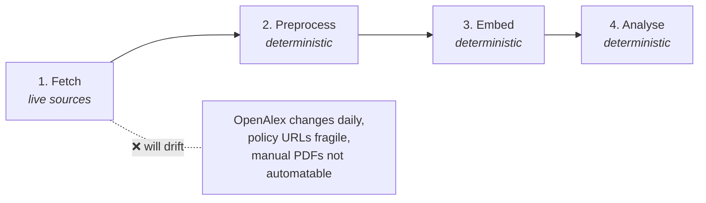

# Dissertation Reproducibility Guide

## What this repository contains

This repository contains the dissertation code, manuscript source, committed outputs, and the canonical reproducibility entrypoint for the submitted MSc project. The dissertation measures research-policy divergence in AI-for-SDG discourse using coverage and semantic-gap outputs. The README is operational only; the manuscript explains the research design, findings, and limitations.

## Prerequisites

| Requirement | Details |
|---|---|
| **Disk space** | Embedded snapshot: ~8.7 GB archive. Raw snapshot: ~3.7 GB archive |
| **Platform** | Full pipeline tested end-to-end on WSL (Ubuntu). On Windows (native): `--warm-replay-without-appendix` / `--warm-replay-with-appendix` and `--appendix-all` work. `--cold-replay` was not tested on bare Windows (OpenAlex re-fetch would cost too much). `--build-pdf` requires bash (WSL/Linux only) |
| **Conda** | Required — environment is defined in `environment.yml` |
| **RAM / VRAM** | 10 GB RAM + 4 GB VRAM is sufficient for the full pipeline (warm replay and cold replay). CPU-only warm replay works on the same RAM budget |
| **Network** | Required for `conda env create` (packages) and `--fetch-data-snapshot` (archive download). Also required for `--cold-replay` (OpenAlex API + HuggingFace model download). Warm replay is fully offline once Conda exists and the snapshot is hydrated |
| **LaTeX** | `latexmk` + `pdflatex` + `biber` for `--build-pdf` |
| **OpenAlex key(s)** | `.env` with `OPENALEX_MAILTO` + `OPENALEX_API_KEY` — only for `--cold-replay`. The full OpenAlex re-fetch cycles through up to 4 parallel API keys and takes approximately 1 week |
| **Embedding runtimes** (one-time, cold replay only) | MiniLM (`all-MiniLM-L6-v2`): ~2.5 hours on 4 GB VRAM GPU. MPNet (`all-mpnet-base-v2`): ~17 hours on 4 GB VRAM GPU |
| **Git** | Required for cloning and pulling updates |

All other dependencies (Python packages, LaTeX packages) are handled by Conda.

## Quick start for markers

"Warm replay" means running the full analysis pipeline from pre-computed
embeddings, skipping the expensive fetch and embed stages. It is the canonical
reproducibility target — deterministic and snapshot-based.

```bash
git clone https://github.com/qmanhbeo/dissertation-bham.git
cd dissertation-bham
conda env create -f environment.yml
conda activate dissertation
# optional: if you have an NVIDIA GPU with CUDA 12.1:
# pip install torch==2.5.1+cu121 --extra-index-url https://download.pytorch.org/whl/cu121

python main.py --warm-replay-without-appendix --overwrite
```

This rebuilds main text outputs from the frozen embedded data snapshot.
Appendix outputs are already committed in the repo and do not need
regeneration. `--overwrite` is included because canonical outputs already exist
in the repo; without it `main.py` fails closed to prevent accidental replacement.
If the snapshot download fails, run `python main.py --fetch-data-snapshot embedded`
then retry.

```bash
# Or if you want to fetch the raw data snapshot for cold-replay rebuilds:
python main.py --fetch-data-snapshot raw
python main.py --warm-replay-without-appendix --overwrite
```

## What the replay produces

Warm replay rebuilds:
- canonical machine-readable outputs under `4_outputs/main/data/`
- manuscript tables and figures under `4_outputs/main/tables/` and `4_outputs/main/figures/`

To build the dissertation PDF from warm-replay outputs, run `python main.py --build-pdf --overwrite` (requires bash — WSL/Linux only). If you have your own LaTeX distribution, you can also compile `3_writing/dissertation.tex` directly with `latexmk`, `pdflatex` + `biber`, or your preferred compiler.

## Tracked vs not tracked

Tracked in Git:
- `main.py`
- `1_code/`
- `3_writing/`
- environment files
- `README.md`
- committed `4_outputs/`

Not tracked in Git:
- `2_data/`

`2_data/` is hydrated from the frozen embedded snapshot. `4_outputs/` is committed for marker inspection but can be regenerated from the snapshot and source code.

### Environment notes

- `environment.yml` is the canonical rebuild path. Pins 13 core Python packages;
  platform-specific libraries (CUDA, Linux libs) are handled by conda/pip per-OS.
- `requirements.txt` is a human-edited core reference (13 packages). Not needed
  for rebuild — `environment.yml` already covers the pip layer.
- Python version: `3.11`.
- CPU is sufficient for `--warm-replay-without-appendix`

## Additional optional commands

| Command | What it does |
|---|---|
| `python main.py` | Read-only status check |
| `python main.py --warm-replay-without-appendix --overwrite` | Rebuild main text analysis from snapshot (no PDF, no appendix) |
| `python main.py --warm-replay-with-appendix --overwrite` | Rebuild main text + all appendix analyses from snapshot (no PDF) |
| `python main.py --cold-replay --overwrite` | Full pipeline from live data sources. Not recommended (long runtime; live changes may break reproducibility — see [§Reproducibility boundaries](#reproducibility-boundaries)). |
| `python main.py --appendix-all --overwrite` | Run all appendix stages (A1–A3, B1–B4, C, D, E) standalone (no PDF) |
| `python main.py --appendix-a1-source --overwrite` | Run A.1 Per-SDG Source Comparison |
| `python main.py --appendix-a2-family --overwrite` | Run A.2 Policy Source-Family Sensitivity |
| `python main.py --appendix-a3-sdg4 --overwrite` | Run A.3 SDG 4 Lexical Artefact Audit |
| `python main.py --appendix-b1-pca --overwrite` | Run B.1 Combined Research-Policy PCA Landscape |
| `python main.py --appendix-b2-centroid --overwrite` | Run B.2 Within-Corpus Centroid Structure |
| `python main.py --appendix-b2-interpret --overwrite` | Run B.2 Lexical Illustration of the Semantic Gap |
| `python main.py --appendix-b4-softmax --overwrite` | Run B.4 Softmax Multi-label SDG |
| `python main.py --appendix-c-sample-stability --overwrite` | Run C Sample-Stability Robustness |
| `python main.py --appendix-f-register --overwrite` | Run F Register-Adjustment Robustness |
| `python main.py --appendix-all --overwrite` | Run all appendix stages (A2, A3, A3b, B1, B2, C, F) standalone (requires existing main-text outputs). |
| `python main.py --build-pdf --overwrite` | Build PDF from existing outputs (WSL/Linux only — requires bash) |
| `python main.py --fetch-data-snapshot embedded` | Hydrate embedded snapshot into `2_data/` |
| `python main.py --fetch-data-snapshot raw` | Hydrate raw snapshot for cold-replay rebuilds |
| `python main.py --backup-data-snapshot {raw\|embedded\|both}` | Create and upload a snapshot archive (maintainer-only — requires rclone on WSL) |

## Reproducibility boundaries

### Warm replay (canonical target)

Deterministic from the frozen embedded snapshot. No network needed after
hydration. Byte-identical across runs and platforms.

### Full cold-replay pipeline



Three deterministic stages produce identical results given frozen inputs.
The fetch stage cannot be reproduced because its sources change continuously.

### What drifts on live re-fetch

| Source | Drift mechanism |
|---|---|
| OpenAlex API | Papers added/deleted daily; abstracts and SDG classifications change |
| Policy scrape URLs | ~42 hardcoded HTTP links; many unconfirmed; PDFs may 403/redirect |
| Manual policy supplement | 64 PDFs from non-API sources — not automatable |
| GitHub benchmark | `SDGClassification/benchmark@main` — moving branch |
| HF dataset / Dataverse | `UNDP/sdgi-corpus` and UNGDC may be versioned |

### Credentials

`--cold-replay` requires OpenAlex API credentials. Copy `.env.example` to
`.env` and fill in your key (free at https://openalex.org/keys). Without
these the fetch stage raises `RuntimeError`. The 4 rate-limit fallback slots
are optional — only `OPENALEX_MAILTO` + `OPENALEX_API_KEY` are strictly
required.

### Snapshot scope

- **Embedded snapshot**: contains only `3_embedded/`. For warm-replay analysis.
  Warm replay from embedded is the canonical reproducibility target.
  No network needed after hydration. Byte-identical across runs and platforms.
- **Raw snapshot**: contains only `0_raw/`. For cold-replay rebuilds.
  Cold replay from raw will re-run preprocessing, segmentation, embedding, and
  training — outputs will differ from the submitted state due to OpenAlex live changes.

## Repository layout

The repository uses a numbered directory convention. Each prefix indicates
the directory's role in the workflow:

- `0_literature/` — cited and consulted sources, organised by paper content
- `1_code/` — all pipeline and analysis code
- `2_data/` — frozen data snapshot (hydrated from archive, gitignored)
- `3_writing/` — manuscript source (`dissertation.tex`, `references.bib`, build script)
- `4_outputs/` — committed outputs (`dissertation.pdf`, `main/` figures and tables, `appendix/` analyses)
- `5_notes/` — working notes, assumptions, and workflow logs

Entrypoint and environment files at root:
- `main.py` — single reproducibility entrypoint
- `environment.yml` — full conda + pip environment specification
- `requirements.txt` — lightweight human-readable dependency reference
- `README.md` — this file
